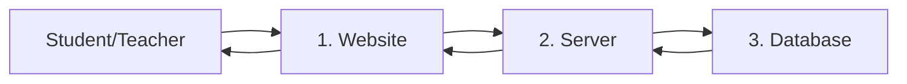

# Data Flow Diagrams - Simple

## How Information Moves

## Simple Explanation

1. **User** clicks something on the website
2. **Website** sends request to server
3. **Server** gets data from database
4. **Server** sends data back to website
5. **Website** shows result to user
