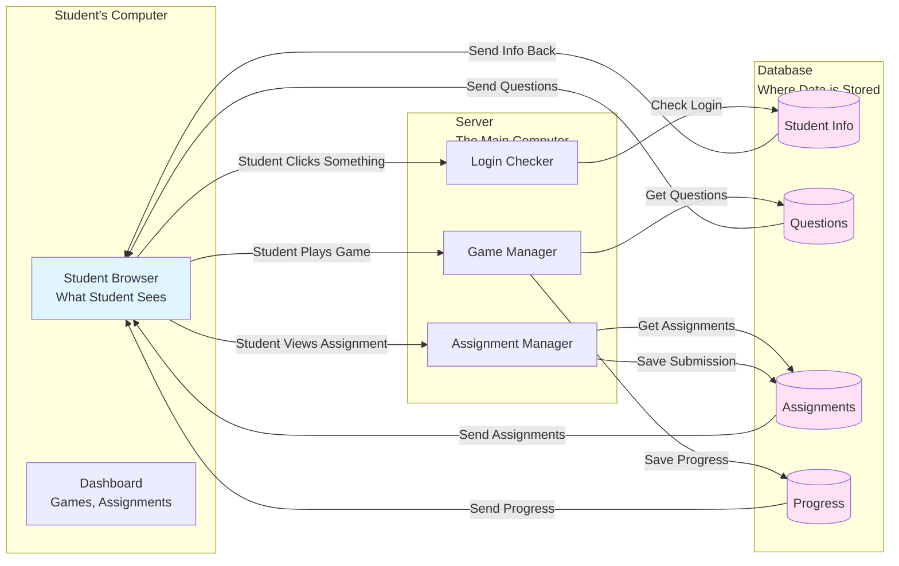
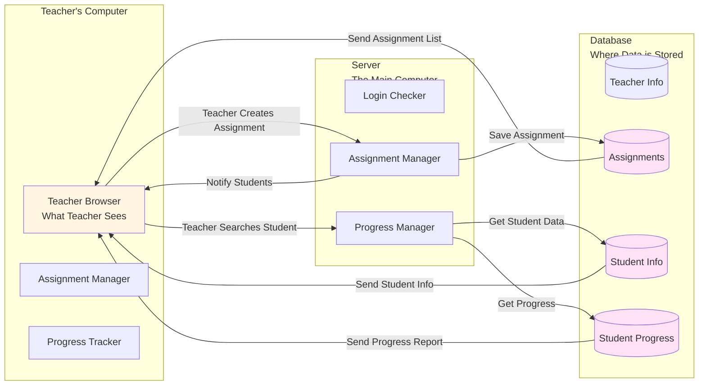

# Data Flow Diagrams - Simple Guide

## What is a Data Flow Diagram?
A data flow diagram shows how information moves through the system. Think of it like showing how a letter travels from sender to receiver through different post offices.

## Simple Explanation: How Information Moves

### Student Side - How Data Flows

### Teacher Side - How Data Flows

## Simple Example: Student Logging In

**Step 1:** Student enters username and password

**Step 2:** System checks: "Is this password correct?"

**Step 3:** 
- If YES → System says "Welcome!" and shows dashboard
- If NO → System says "Wrong password, try again"

**Step 4:** System remembers student is logged in

**Step 5:** Student can now access games, assignments, etc.

## Simple Example: Student Playing a Game

**Step 1:** Student clicks "Start Game"

**Step 2:** System gets a question from the question bank

**Step 3:** System shows question to student

**Step 4:** Student answers the question

**Step 5:** System checks: "Is the answer correct?"

**Step 6:** 
- If YES → System saves progress, updates leaderboard
- If NO → System says "Try again"

**Step 7:** System shows next question or level complete

## Simple Example: Teacher Creating Assignment

**Step 1:** Teacher fills out assignment form

**Step 2:** Teacher clicks "Save"

**Step 3:** System saves assignment in database

**Step 4:** System sends notification to all students

**Step 5:** Students see new assignment appear on their screen

**Step 6:** Students can now view and submit the assignment

## Simple Example: Teacher Checking Student Progress

**Step 1:** Teacher enters student's USN

**Step 2:** System searches for student in database

**Step 3:** System collects all student's information:
- Game progress
- Assignment submissions
- Badges and streaks

**Step 4:** System shows complete report to teacher

**Step 5:** Teacher can see how student is performing

## Key Concepts Explained Simply

### What is a Database?
Think of it like a filing cabinet where all information is stored:
- Student information
- Questions
- Assignments
- Progress records

### What is a Server?
Think of it as the main computer that:
- Checks if login is correct
- Gets questions from database
- Saves student progress
- Sends information back to student/teacher

### What is Real-time Notification?
When teacher creates an assignment, students see it immediately on their screen - like getting an instant message!

### How Does Information Flow?
1. **Student/Teacher** does something (clicks button, enters data)
2. **Browser** sends request to server
3. **Server** checks database
4. **Database** sends information back
5. **Server** processes information
6. **Browser** shows result to student/teacher

## Important Points

- All data is stored safely in the database
- System checks login before allowing access
- Progress is saved automatically
- Students get instant notifications when teachers create assignments
- Everything happens quickly and automatically
