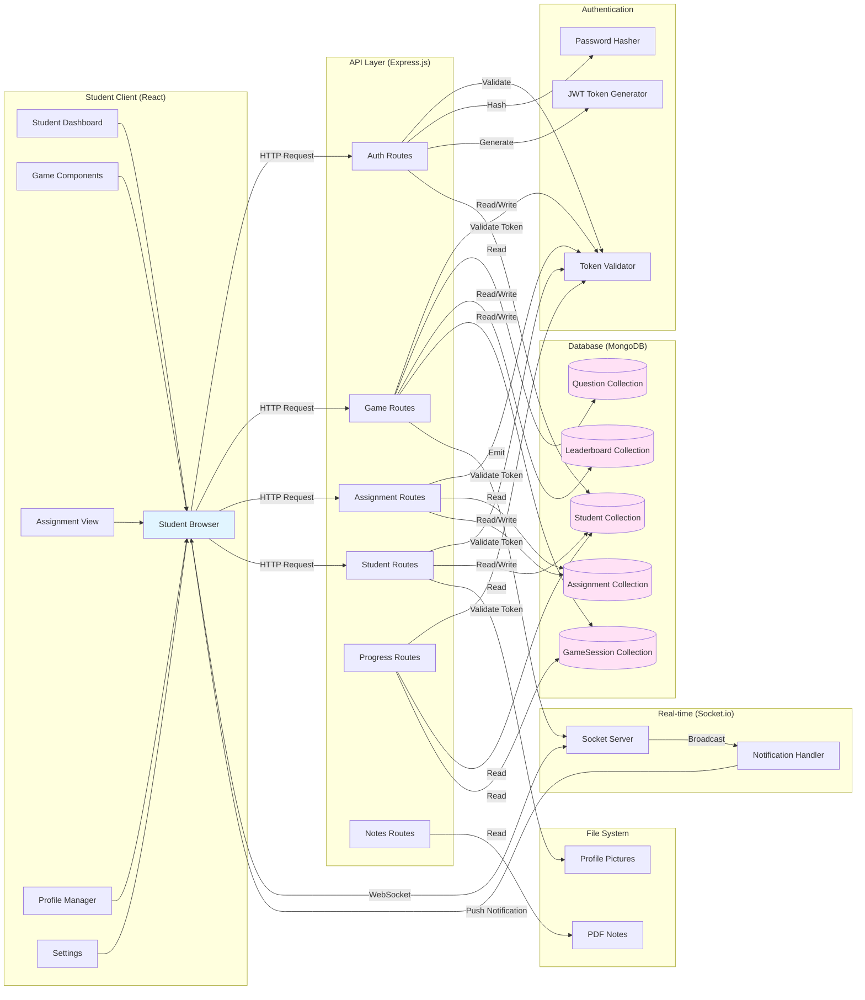
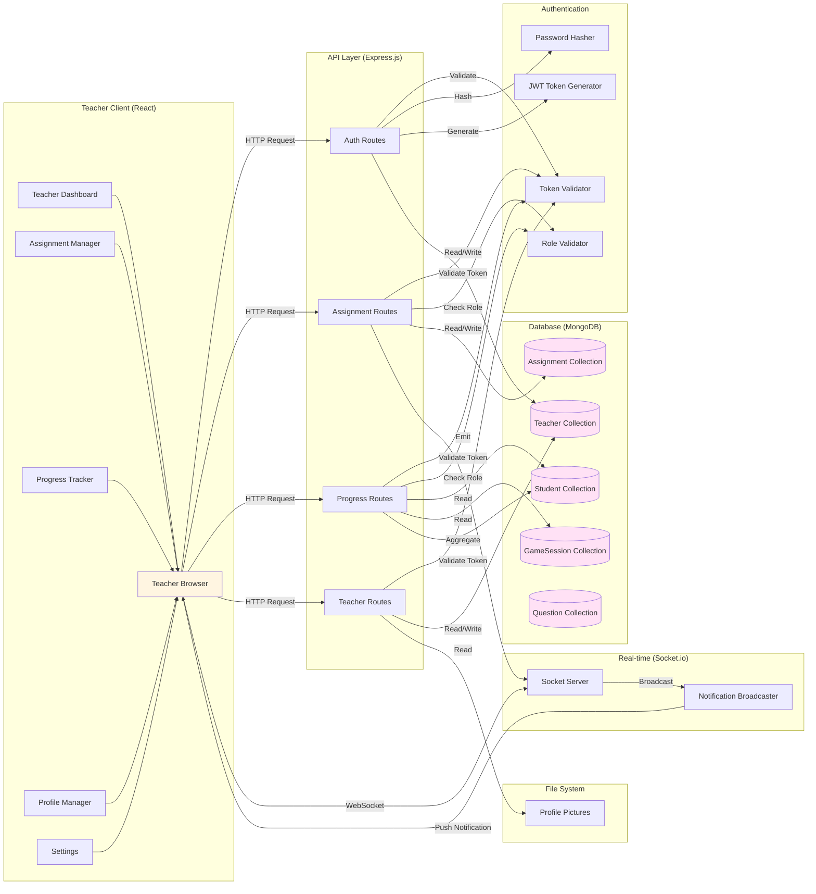
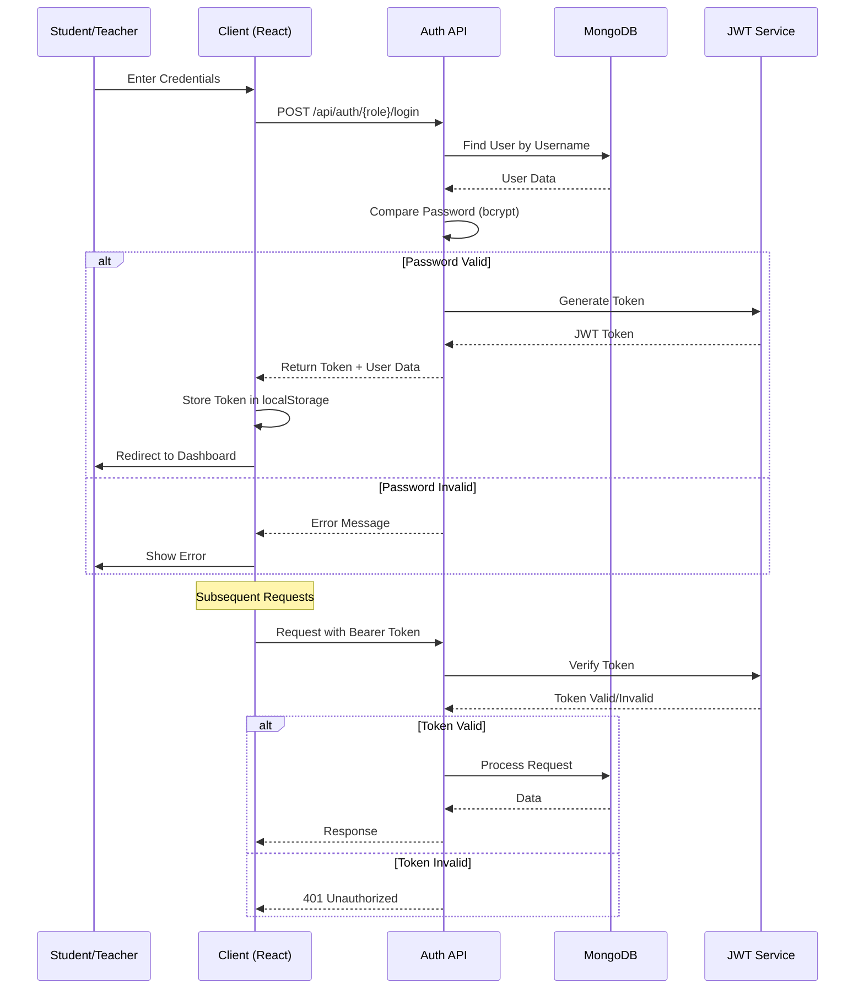
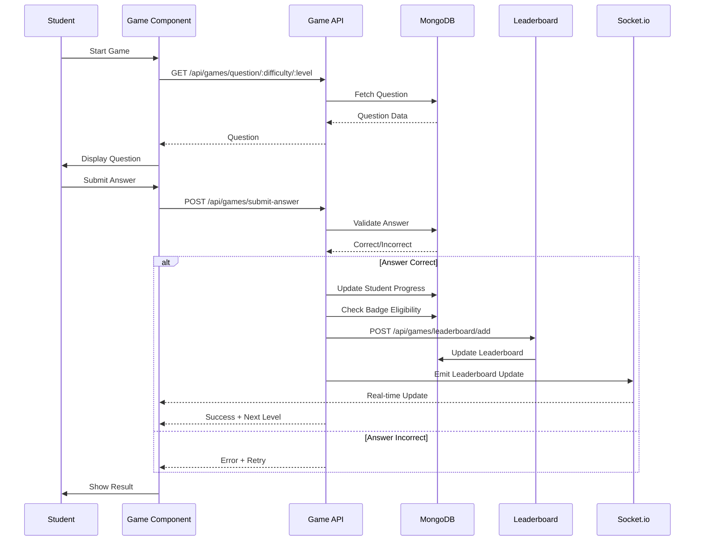
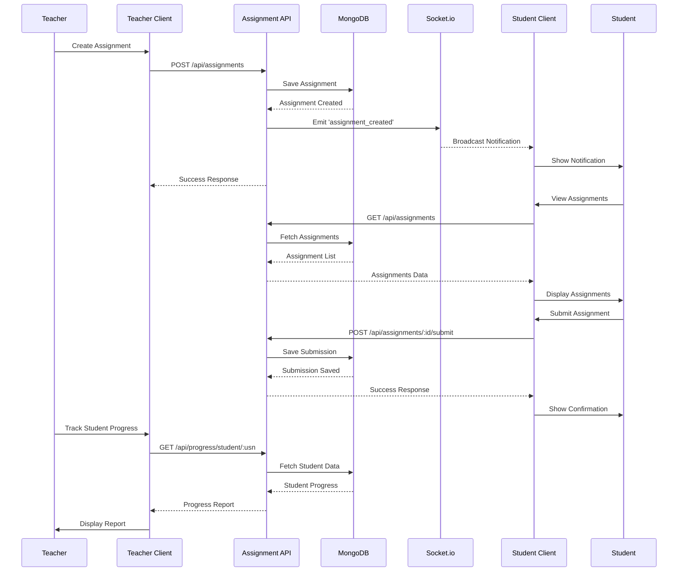

# Data Flow Diagrams

## Student Data Flow Diagram

```mermaid
flowchart LR
    subgraph "Student Client (React)"
        A[Student Browser]
        B[Student Dashboard]
        C[Game Components]
        D[Assignment View]
        E[Profile Manager]
        F[Settings]
    end
    
    subgraph "API Layer (Express.js)"
        G[Auth Routes]
        H[Game Routes]
        I[Assignment Routes]
        J[Student Routes]
        K[Progress Routes]
        L[Notes Routes]
    end
    
    subgraph "Authentication"
        M[JWT Token Generator]
        N[Password Hasher]
        O[Token Validator]
    end
    
    subgraph "Database (MongoDB)"
        P[(Student Collection)]
        Q[(Question Collection)]
        R[(Assignment Collection)]
        S[(Leaderboard Collection)]
        T[(GameSession Collection)]
    end
    
    subgraph "Real-time (Socket.io)"
        U[Socket Server]
        V[Notification Handler]
    end
    
    subgraph "File System"
        W[Profile Pictures]
        X[PDF Notes]
    end
    
    A -->|HTTP Request| G
    A -->|HTTP Request| H
    A -->|HTTP Request| I
    A -->|HTTP Request| J
    A -->|WebSocket| U
    
    B --> A
    C --> A
    D --> A
    E --> A
    F --> A
    
    G -->|Validate| O
    G -->|Hash| N
    G -->|Generate| M
    G -->|Read/Write| P
    
    H -->|Validate Token| O
    H -->|Read| Q
    H -->|Read/Write| S
    H -->|Read/Write| T
    H -->|Emit| U
    
    I -->|Validate Token| O
    I -->|Read| R
    I -->|Read/Write| R
    
    J -->|Validate Token| O
    J -->|Read/Write| P
    J -->|Read| W
    
    K -->|Validate Token| O
    K -->|Read| P
    K -->|Read| T
    
    L -->|Read| X
    
    U -->|Broadcast| V
    V -->|Push Notification| A
    
    style A fill:#e1f5ff
    style P fill:#ffe1f5
    style Q fill:#ffe1f5
    style R fill:#ffe1f5
    style S fill:#ffe1f5
    style T fill:#ffe1f5
```

## Teacher Data Flow Diagram

```mermaid
flowchart LR
    subgraph "Teacher Client (React)"
        A[Teacher Browser]
        B[Teacher Dashboard]
        C[Assignment Manager]
        D[Progress Tracker]
        E[Profile Manager]
        F[Settings]
    end
    
    subgraph "API Layer (Express.js)"
        G[Auth Routes]
        H[Assignment Routes]
        I[Progress Routes]
        J[Teacher Routes]
    end
    
    subgraph "Authentication"
        K[JWT Token Generator]
        L[Password Hasher]
        M[Token Validator]
        N[Role Validator]
    end
    
    subgraph "Database (MongoDB)"
        O[(Teacher Collection)]
        P[(Assignment Collection)]
        Q[(Student Collection)]
        R[(GameSession Collection)]
        S[(Question Collection)]
    end
    
    subgraph "Real-time (Socket.io)"
        T[Socket Server]
        U[Notification Broadcaster]
    end
    
    subgraph "File System"
        V[Profile Pictures]
    end
    
    A -->|HTTP Request| G
    A -->|HTTP Request| H
    A -->|HTTP Request| I
    A -->|HTTP Request| J
    A -->|WebSocket| T
    
    B --> A
    C --> A
    D --> A
    E --> A
    F --> A
    
    G -->|Validate| M
    G -->|Hash| L
    G -->|Generate| K
    G -->|Read/Write| O
    
    H -->|Validate Token| M
    H -->|Check Role| N
    H -->|Read/Write| P
    H -->|Emit| T
    
    I -->|Validate Token| M
    I -->|Check Role| N
    I -->|Read| Q
    I -->|Read| R
    I -->|Aggregate| Q
    
    J -->|Validate Token| M
    J -->|Read/Write| O
    J -->|Read| V
    
    T -->|Broadcast| U
    U -->|Push Notification| A
    
    style A fill:#fff5e1
    style O fill:#ffe1f5
    style P fill:#ffe1f5
    style Q fill:#ffe1f5
    style R fill:#ffe1f5
    style S fill:#ffe1f5
```

## Authentication Data Flow

```mermaid
sequenceDiagram
    participant S as Student/Teacher
    participant C as Client (React)
    participant A as Auth API
    participant DB as MongoDB
    participant JWT as JWT Service
    
    S->>C: Enter Credentials
    C->>A: POST /api/auth/{role}/login
    A->>DB: Find User by Username
    DB-->>A: User Data
    A->>A: Compare Password (bcrypt)
    alt Password Valid
        A->>JWT: Generate Token
        JWT-->>A: JWT Token
        A-->>C: Return Token + User Data
        C->>C: Store Token in localStorage
        C->>S: Redirect to Dashboard
    else Password Invalid
        A-->>C: Error Message
        C->>S: Show Error
    end
    
    Note over C: Subsequent Requests
    C->>A: Request with Bearer Token
    A->>JWT: Verify Token
    JWT-->>A: Token Valid/Invalid
    alt Token Valid
        A->>DB: Process Request
        DB-->>A: Data
        A-->>C: Response
    else Token Invalid
        A-->>C: 401 Unauthorized
    end
```

## Game Session Data Flow

```mermaid
sequenceDiagram
    participant S as Student
    participant GC as Game Component
    participant GA as Game API
    participant DB as MongoDB
    participant LB as Leaderboard
    participant SO as Socket.io
    
    S->>GC: Start Game
    GC->>GA: GET /api/games/question/:difficulty/:level
    GA->>DB: Fetch Question
    DB-->>GA: Question Data
    GA-->>GC: Question
    GC->>S: Display Question
    
    S->>GC: Submit Answer
    GC->>GA: POST /api/games/submit-answer
    GA->>DB: Validate Answer
    DB-->>GA: Correct/Incorrect
    
    alt Answer Correct
        GA->>DB: Update Student Progress
        GA->>DB: Check Badge Eligibility
        GA->>LB: POST /api/games/leaderboard/add
        LB->>DB: Update Leaderboard
        GA->>SO: Emit Leaderboard Update
        SO-->>GC: Real-time Update
        GA-->>GC: Success + Next Level
    else Answer Incorrect
        GA-->>GC: Error + Retry
    end
    
    GC->>S: Show Result
```

## Assignment Data Flow

```mermaid
sequenceDiagram
    participant T as Teacher
    participant TC as Teacher Client
    participant AA as Assignment API
    participant DB as MongoDB
    participant SO as Socket.io
    participant SC as Student Client
    participant S as Student
    
    T->>TC: Create Assignment
    TC->>AA: POST /api/assignments
    AA->>DB: Save Assignment
    DB-->>AA: Assignment Created
    AA->>SO: Emit 'assignment_created'
    SO-->>SC: Broadcast Notification
    SC->>S: Show Notification
    AA-->>TC: Success Response
    
    S->>SC: View Assignments
    SC->>AA: GET /api/assignments
    AA->>DB: Fetch Assignments
    DB-->>AA: Assignment List
    AA-->>SC: Assignments Data
    SC->>S: Display Assignments
    
    S->>SC: Submit Assignment
    SC->>AA: POST /api/assignments/:id/submit
    AA->>DB: Save Submission
    DB-->>AA: Submission Saved
    AA-->>SC: Success Response
    SC->>S: Show Confirmation
    
    T->>TC: Track Student Progress
    TC->>AA: GET /api/progress/student/:usn
    AA->>DB: Fetch Student Data
    DB-->>AA: Student Progress
    AA-->>TC: Progress Report
    TC->>T: Display Report
```

