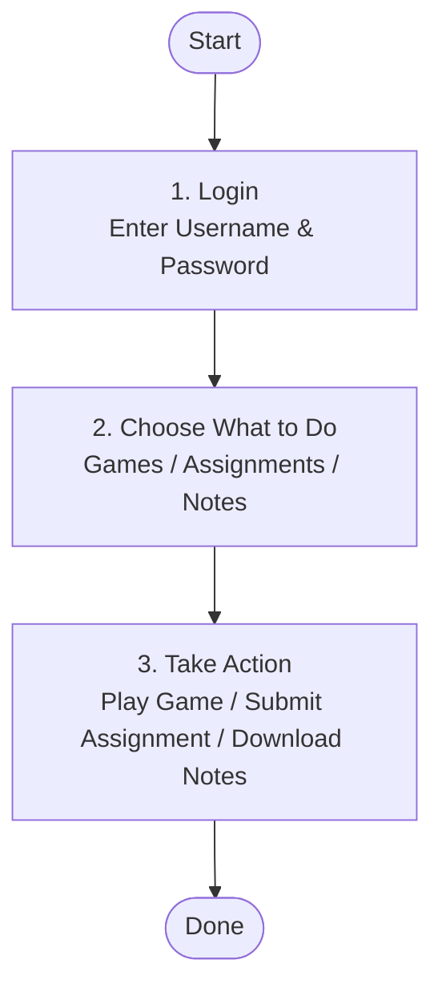
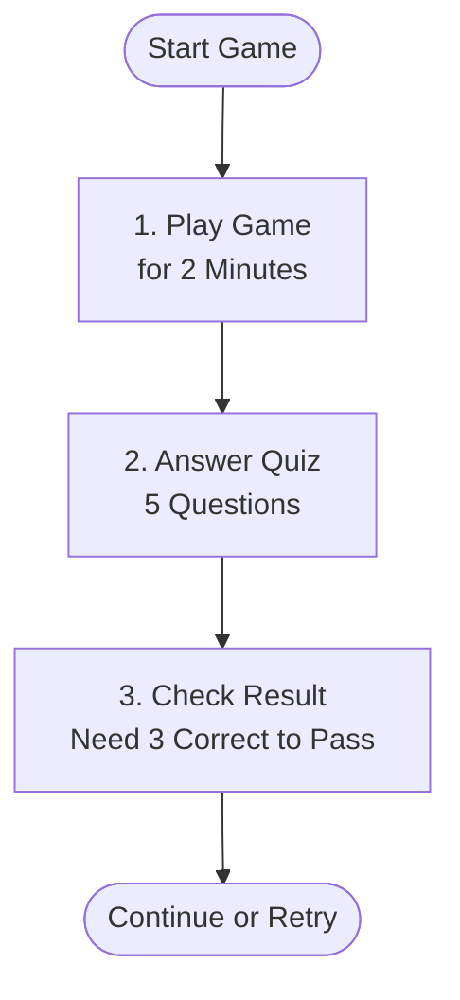
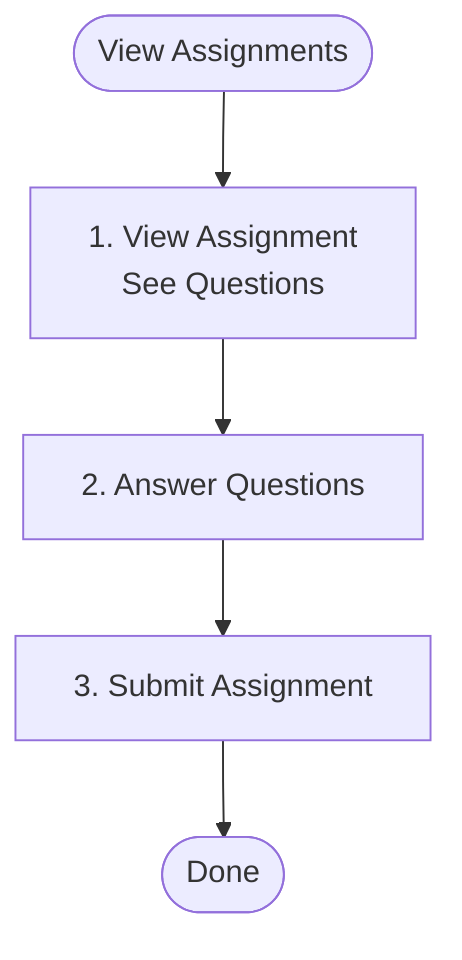

# Student Flowchart - Simple

## Student Workflow

```mermaid
flowchart TD
    Start([Start]) --> Login[1. Login<br/>Enter Username & Password]
    Login --> Dashboard[2. Choose What to Do<br/>Games / Assignments / Notes]
    Dashboard --> Action[3. Take Action<br/>Play Game / Submit Assignment / Download Notes]
    Action --> End([Done])
```

## Student Game Flow

```mermaid
flowchart TD
    Start([Start Game]) --> Play[1. Play Game<br/>for 2 Minutes]
    Play --> Quiz[2. Answer Quiz<br/>5 Questions]
    Quiz --> Result[3. Check Result<br/>Need 3 Correct to Pass]
    Result --> End([Continue or Retry])
```

## Student Assignment Flow

```mermaid
flowchart TD
    Start([View Assignments]) --> View[1. View Assignment<br/>See Questions]
    View --> Answer[2. Answer Questions]
    Answer --> Submit[3. Submit Assignment]
    Submit --> End([Done])
```
