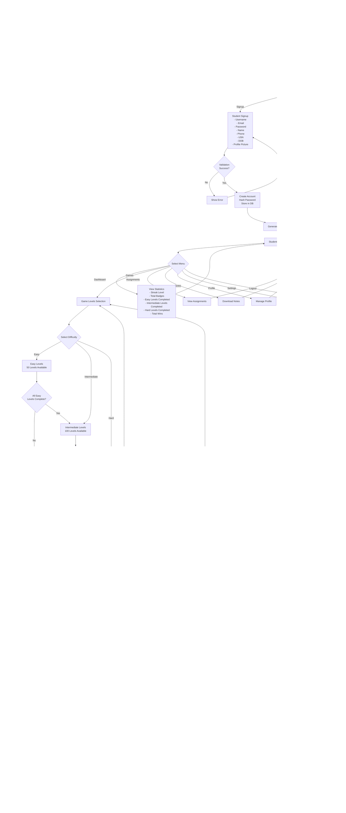
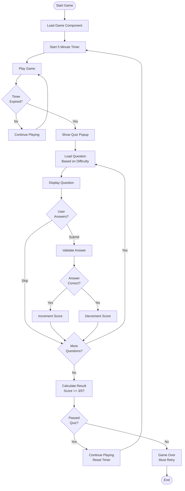
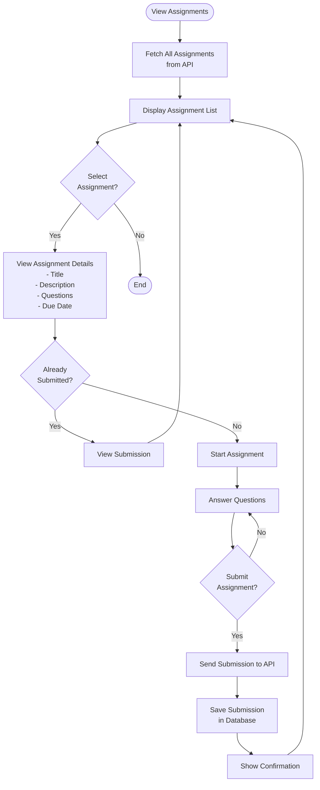

# Student Flowchart

## Student Main Flowchart

```mermaid
flowchart TD
    Start([Start]) --> LandingPage[Landing Page]
    LandingPage --> RoleSelect{Select Role}
    RoleSelect -->|Student| StudentAuth[Student Authentication]
    
    StudentAuth --> AuthChoice{Login or Signup?}
    AuthChoice -->|Signup| Signup[Student Signup<br/>- Username<br/>- Email<br/>- Password<br/>- Name<br/>- Phone<br/>- USN<br/>- DOB<br/>- Profile Picture]
    AuthChoice -->|Login| Login[Student Login<br/>- Username<br/>- Password]
    
    Signup --> ValidateSignup{Validation<br/>Success?}
    ValidateSignup -->|No| SignupError[Show Error] --> Signup
    ValidateSignup -->|Yes| CreateAccount[Create Account<br/>Hash Password<br/>Store in DB]
    
    Login --> ValidateLogin{Credentials<br/>Valid?}
    ValidateLogin -->|No| LoginError[Show Error] --> Login
    ValidateLogin -->|Yes| GenerateToken[Generate JWT Token]
    
    CreateAccount --> GenerateToken
    GenerateToken --> StudentDashboard[Student Dashboard]
    
    StudentDashboard --> MenuChoice{Select Menu}
    
    MenuChoice -->|Dashboard| ViewStats[View Statistics<br/>- Streak Level<br/>- Total Badges<br/>- Easy Levels Completed<br/>- Intermediate Levels Completed<br/>- Hard Levels Completed<br/>- Total Wins]
    
    MenuChoice -->|Games| GameLevels[Game Levels Selection]
    MenuChoice -->|Assignments| ViewAssignments[View Assignments]
    MenuChoice -->|Notes| DownloadNotes[Download Notes]
    MenuChoice -->|Profile| ManageProfile[Manage Profile]
    MenuChoice -->|Settings| ManageSettings[Manage Settings]
    MenuChoice -->|Logout| Logout[Logout] --> LandingPage
    
    ViewStats --> StudentDashboard
    ViewAssignments --> StudentDashboard
    DownloadNotes --> StudentDashboard
    ManageProfile --> StudentDashboard
    ManageSettings --> StudentDashboard
    
    GameLevels --> LevelChoice{Select Difficulty}
    LevelChoice -->|Easy| EasyLevels[Easy Levels<br/>50 Levels Available]
    LevelChoice -->|Intermediate| IntermediateLevels[Intermediate Levels<br/>100 Levels Available]
    LevelChoice -->|Hard| HardLevels[Hard Levels<br/>50 Levels Available]
    
    EasyLevels --> CheckEasyAccess{All Easy<br/>Levels Complete?}
    CheckEasyAccess -->|No| EasyGame[Play Easy Game<br/>- MCQ Questions<br/>- Questions every 5 min]
    CheckEasyAccess -->|Yes| IntermediateLevels
    
    IntermediateLevels --> CheckIntermediateAccess{All Intermediate<br/>Levels Complete?}
    CheckIntermediateAccess -->|No| IntermediateGame[Play Intermediate Game<br/>- Code Block Arrangement<br/>- Questions every 5 min<br/>- Gold Badge: 5 consecutive<br/>  questions in 45 sec each]
    CheckIntermediateAccess -->|Yes| HardLevels
    
    HardLevels --> CheckHardAccess{All Hard<br/>Levels Complete?}
    CheckHardAccess -->|No| HardGame[Play Hard Game<br/>- Spin Wheel for Language<br/>- Write Complete Code<br/>- First 5 to complete pass]
    CheckHardAccess -->|Yes| AllComplete[All Levels Complete]
    
    EasyGame --> AnswerQuestion{Answer<br/>Question}
    AnswerQuestion -->|Correct| UpdateProgress[Update Progress<br/>- Level Completed<br/>- Update Streak<br/>- Check Badge]
    AnswerQuestion -->|Incorrect| RetryQuestion[Retry Question]
    
    IntermediateGame --> ArrangeCode{Arrange Code<br/>Blocks}
    ArrangeCode -->|Correct| CheckTime{Time < 45 sec?}
    ArrangeCode -->|Incorrect| RetryQuestion
    CheckTime -->|Yes| UpdateBadge[Update Badge Count]
    CheckTime -->|No| UpdateProgress
    UpdateBadge --> UpdateProgress
    
    HardGame --> SelectLanguage[Spin Wheel<br/>Select Language]
    SelectLanguage --> WriteCode[Write Code<br/>15-20 lines]
    WriteCode --> SubmitCode[Submit Code]
    SubmitCode --> CheckPosition{Position in<br/>First 5?}
    CheckPosition -->|Yes| UpdateProgress
    CheckPosition -->|No| RetryHard[Retry Hard Level]
    
    UpdateProgress --> UpdateLeaderboard[Update Leaderboard]
    UpdateLeaderboard --> CheckStreak{30 min<br/>Playtime Today?}
    CheckStreak -->|Yes| UpdateStreak[Update Streak Level]
    CheckStreak -->|No| GameLevels
    UpdateStreak --> GameLevels
    
    RetryQuestion --> EasyGame
    RetryQuestion --> IntermediateGame
    RetryHard --> HardGame
    AllComplete --> StudentDashboard
    
    End([End])
    Logout --> End
```

## Student Game Flowchart

```mermaid
flowchart TD
    Start([Start Game]) --> LoadGame[Load Game Component]
    LoadGame --> StartTimer[Start 5 Minute Timer]
    StartTimer --> PlayGame[Play Game]
    
    PlayGame --> TimerCheck{Timer<br/>Expired?}
    TimerCheck -->|No| ContinuePlaying[Continue Playing]
    TimerCheck -->|Yes| ShowQuiz[Show Quiz Popup]
    
    ContinuePlaying --> PlayGame
    
    ShowQuiz --> LoadQuestion[Load Question<br/>Based on Difficulty]
    LoadQuestion --> DisplayQuestion[Display Question]
    
    DisplayQuestion --> AnswerInput{User<br/>Answers?}
    AnswerInput -->|Submit| ValidateAnswer[Validate Answer]
    AnswerInput -->|Skip| NextQuestion{More<br/>Questions?}
    
    ValidateAnswer --> CheckCorrect{Answer<br/>Correct?}
    CheckCorrect -->|Yes| IncrementScore[Increment Score]
    CheckCorrect -->|No| DecrementScore[Decrement Score]
    
    IncrementScore --> NextQuestion
    DecrementScore --> NextQuestion
    
    NextQuestion -->|Yes| LoadQuestion
    NextQuestion -->|No| CalculateResult[Calculate Result<br/>Score >= 3/5?]
    
    CalculateResult --> CheckPass{Passed<br/>Quiz?}
    CheckPass -->|Yes| ContinueGame[Continue Playing<br/>Reset Timer]
    CheckPass -->|No| GameOver[Game Over<br/>Must Retry]
    
    ContinueGame --> StartTimer
    GameOver --> End([End])
```

## Student Assignment Flowchart

```mermaid
flowchart TD
    Start([View Assignments]) --> FetchAssignments[Fetch All Assignments<br/>from API]
    FetchAssignments --> DisplayAssignments[Display Assignment List]
    
    DisplayAssignments --> SelectAssignment{Select<br/>Assignment?}
    SelectAssignment -->|Yes| ViewDetails[View Assignment Details<br/>- Title<br/>- Description<br/>- Questions<br/>- Due Date]
    SelectAssignment -->|No| End([End])
    
    ViewDetails --> CheckSubmission{Already<br/>Submitted?}
    CheckSubmission -->|Yes| ViewSubmission[View Submission]
    CheckSubmission -->|No| StartAssignment[Start Assignment]
    
    StartAssignment --> AnswerQuestions[Answer Questions]
    AnswerQuestions --> SubmitAssignment{Submit<br/>Assignment?}
    SubmitAssignment -->|Yes| SendSubmission[Send Submission to API]
    SubmitAssignment -->|No| AnswerQuestions
    
    SendSubmission --> SaveSubmission[Save Submission<br/>in Database]
    SaveSubmission --> Confirmation[Show Confirmation]
    Confirmation --> DisplayAssignments
    
    ViewSubmission --> DisplayAssignments
```

