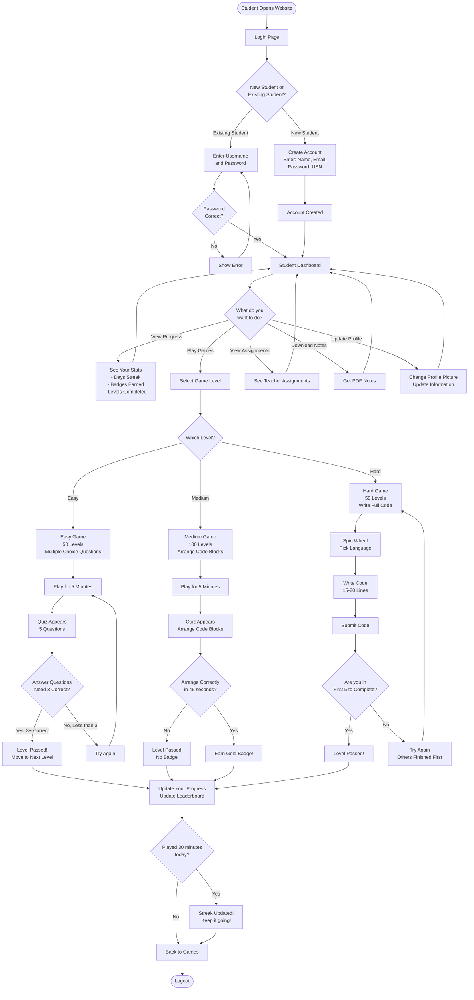
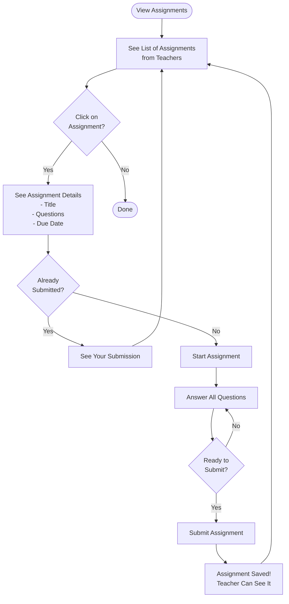

# Student Flowchart - Simple Guide

## What is a Flowchart?
A flowchart shows step-by-step what happens when a student uses the system. Think of it like a map showing the path from start to finish.

## Student Journey - Simple Version

## How Games Work - Simple Explanation

**Step 1:** Student selects a game level (Easy, Medium, or Hard)

**Step 2:** Student plays a fun game for 5 minutes

**Step 3:** After 5 minutes, a quiz appears automatically

**Step 4:** Student answers 5 questions

**Step 5:** 
- If student gets 3 or more correct → Pass! Can continue playing
- If student gets less than 3 correct → Must try again

**Step 6:** Progress is saved, leaderboard updates, and streak is maintained if student played 30 minutes today

## Easy Level
- **What:** Multiple choice questions (pick the right answer)
- **How many:** 50 levels
- **Example:** "What does this code do?" with 4 options

## Medium Level  
- **What:** Arrange code blocks in correct order
- **How many:** 100 levels
- **Special:** Get gold badge if you answer 5 questions correctly in under 45 seconds each

## Hard Level
- **What:** Write complete code (15-20 lines)
- **How many:** 50 levels
- **Special:** Only first 5 students to complete correctly can pass. Others must try again.

## Assignments - Simple Flow

## Key Points for Students

1. **Login:** Use your username and password
2. **Games:** Play for 5 minutes, then answer quiz questions
3. **Progress:** System tracks your levels, badges, and streaks
4. **Streak:** Play 30 minutes daily to keep your streak going
5. **Assignments:** View and submit assignments from teachers
6. **Notes:** Download PDF notes for C, C++, Java, Python
