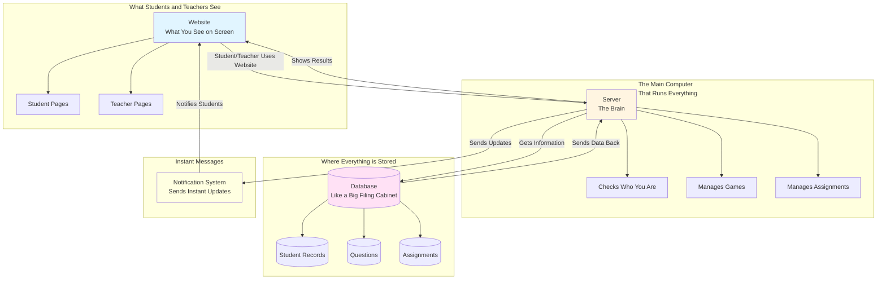
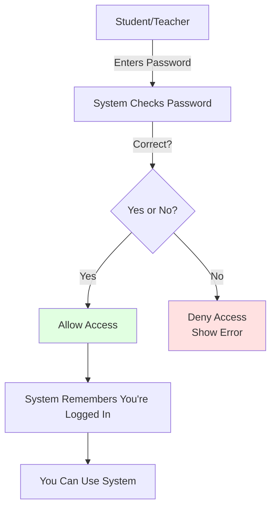

# System Architecture - Simple Guide

## What is System Architecture?
System architecture is like a blueprint of a house - it shows all the parts and how they connect. This document explains how the school system is built in simple terms.

## The Big Picture - How Everything Connects



## Simple Explanation of Each Part

### 1. Website (What You See)
- **What it is:** The pages students and teachers see on their computer
- **What it does:** Shows games, assignments, progress, etc.
- **Example:** When you click "Play Game", this is what shows the game

### 2. Server (The Brain)
- **What it is:** The main computer that runs everything
- **What it does:** 
  - Checks if login is correct
  - Gets questions from database
  - Saves student progress
  - Manages assignments
- **Example:** When student answers a question, server checks if it's correct

### 3. Database (The Filing Cabinet)
- **What it is:** Where all information is stored
- **What it stores:**
  - Student accounts and passwords
  - All questions for games
  - Assignments created by teachers
  - Student progress and scores
- **Example:** Like a library where all books (data) are kept

### 4. Notification System (Instant Messages)
- **What it is:** System that sends instant updates
- **What it does:** Tells students immediately when teacher creates assignment
- **Example:** Like getting a text message instantly

## How the System Works - Step by Step

### Example 1: Student Logging In

```
Student enters password
    ↓
Website sends to Server
    ↓
Server checks Database
    ↓
Database says "Password correct!"
    ↓
Server tells Website "Show dashboard"
    ↓
Student sees dashboard
```

### Example 2: Student Playing Game

```
Student clicks "Start Game"
    ↓
Website asks Server for question
    ↓
Server gets question from Database
    ↓
Database sends question
    ↓
Server sends question to Website
    ↓
Student sees question and answers
    ↓
Website sends answer to Server
    ↓
Server checks if correct in Database
    ↓
Server saves progress in Database
    ↓
Server updates leaderboard
    ↓
Website shows "Correct!" to student
```

### Example 3: Teacher Creating Assignment

```
Teacher fills form and clicks "Save"
    ↓
Website sends assignment to Server
    ↓
Server saves in Database
    ↓
Server sends notification to all students
    ↓
All students see new assignment instantly
```

## The Three Main Parts Explained Simply

### Frontend (What You See)
- **Student Pages:** Games, assignments, profile
- **Teacher Pages:** Create assignments, track progress
- **Login Pages:** Where you enter username/password

### Backend (The Brain)
- **Login Checker:** Makes sure password is correct
- **Game Manager:** Handles all game questions and scoring
- **Assignment Manager:** Handles creating and viewing assignments
- **Progress Tracker:** Tracks student performance

### Database (The Storage)
- **Student Table:** All student information
- **Teacher Table:** All teacher information  
- **Question Table:** All game questions
- **Assignment Table:** All assignments
- **Progress Table:** All student progress records

## Security - How the System Stays Safe



**Simple Security Rules:**
1. **Passwords are encrypted** - Like putting your password in a safe
2. **Only logged-in users can access** - Like needing a key to enter a room
3. **Teachers can only see their own assignments** - Like only seeing your own files
4. **Students can only see their own progress** - Like only seeing your own grades

## How Fast Does It Work?

- **Login:** Less than 1 second
- **Loading Game:** Less than 2 seconds
- **Saving Progress:** Less than 1 second
- **Notifications:** Instant (appears immediately)

## Important Points

1. **Everything is connected:** Website talks to Server, Server talks to Database
2. **Data is safe:** Passwords are encrypted, only authorized users can access
3. **It's fast:** Most actions happen in less than 2 seconds
4. **It's automatic:** Progress saves automatically, notifications send instantly
5. **It's reliable:** System keeps working even if many students use it at once

## Simple Comparison

Think of the system like a restaurant:

- **Website** = The menu and dining area (what customers see)
- **Server** = The kitchen staff (prepares and manages everything)
- **Database** = The pantry (stores all ingredients/data)
- **Notifications** = The waiter (brings updates instantly)

When you order food (click something), the kitchen (server) gets ingredients (data) from pantry (database), prepares it, and waiter (notifications) brings it to you!
