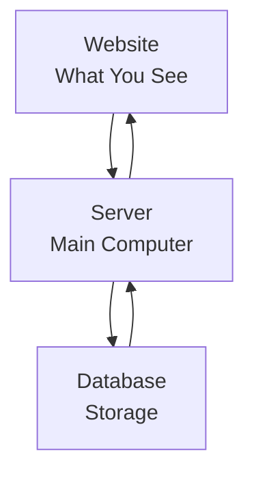

# System Architecture - Simple

## How System Works

## Simple Explanation

1. **Website** - What students and teachers see
2. **Server** - The main computer that runs everything
3. **Database** - Where all information is stored
