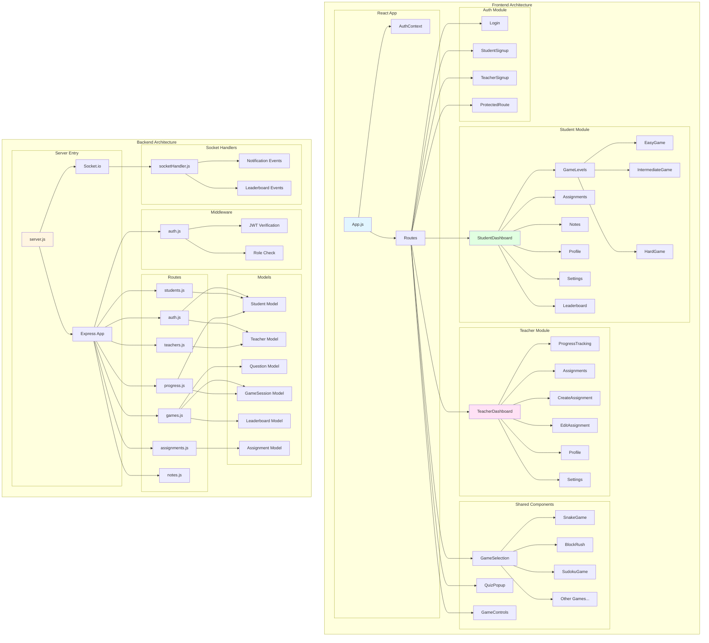
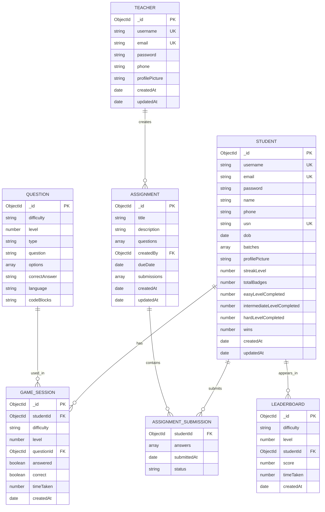
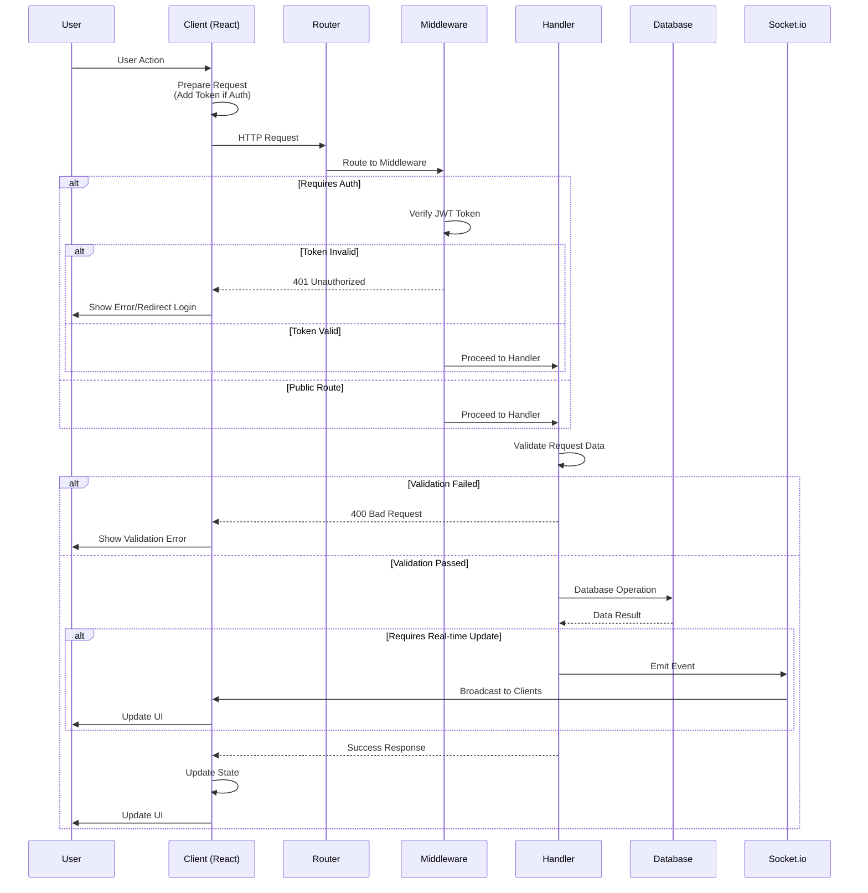
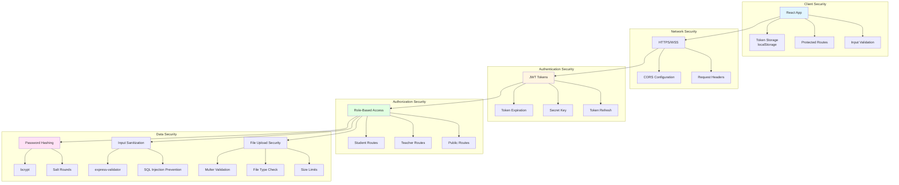

# System Architecture Diagram

## Overall System Architecture

```mermaid
graph TB
    subgraph "Client Layer"
        A[React Frontend<br/>Port: 3000]
        A1[Student Components]
        A2[Teacher Components]
        A3[Auth Components]
        A4[Game Components]
        A --> A1
        A --> A2
        A --> A3
        A --> A4
    end
    
    subgraph "API Gateway Layer"
        B[Express.js Server<br/>Port: 5000]
        B1[Auth Middleware]
        B2[Role Middleware]
        B3[Error Handler]
        B --> B1
        B --> B2
        B --> B3
    end
    
    subgraph "Business Logic Layer"
        C[Route Handlers]
        C1[/api/auth]
        C2[/api/students]
        C3[/api/teachers]
        C4[/api/games]
        C5[/api/assignments]
        C6[/api/progress]
        C7[/api/notes]
        C --> C1
        C --> C2
        C --> C3
        C --> C4
        C --> C5
        C --> C6
        C --> C7
    end
    
    subgraph "Data Access Layer"
        D[Mongoose ODM]
        D1[Student Model]
        D2[Teacher Model]
        D3[Assignment Model]
        D4[Question Model]
        D5[GameSession Model]
        D6[Leaderboard Model]
        D --> D1
        D --> D2
        D --> D3
        D --> D4
        D --> D5
        D --> D6
    end
    
    subgraph "Data Storage Layer"
        E[(MongoDB Database)]
        E1[(students)]
        E2[(teachers)]
        E3[(assignments)]
        E4[(questions)]
        E5[(gamesessions)]
        E6[(leaderboards)]
        E --> E1
        E --> E2
        E --> E3
        E --> E4
        E --> E5
        E --> E6
    end
    
    subgraph "Real-time Communication"
        F[Socket.io Server]
        F1[Notification Service]
        F2[Leaderboard Updates]
        F --> F1
        F --> F2
    end
    
    subgraph "File Storage"
        G[File System]
        G1[Profile Pictures<br/>/uploads/profiles]
        G2[PDF Notes<br/>/notes]
        G --> G1
        G --> G2
    end
    
    subgraph "External Services"
        H[JWT Service]
        I[bcrypt Service]
        J[Multer Upload]
        H --> B1
        I --> C1
        J --> C2
        J --> C3
    end
    
    A -->|HTTP/HTTPS| B
    A -->|WebSocket| F
    B --> C
    C --> D
    D --> E
    C --> F
    C --> G
    C --> H
    C --> I
    C --> J
    F --> A
    
    style A fill:#e1f5ff
    style B fill:#fff5e1
    style C fill:#e1ffe1
    style D fill:#ffe1f5
    style E fill:#f5e1ff
    style F fill:#ffffe1
    style G fill:#e1ffff
```

## Component Architecture



## Database Schema Architecture



## Request Flow Architecture



## Security Architecture



