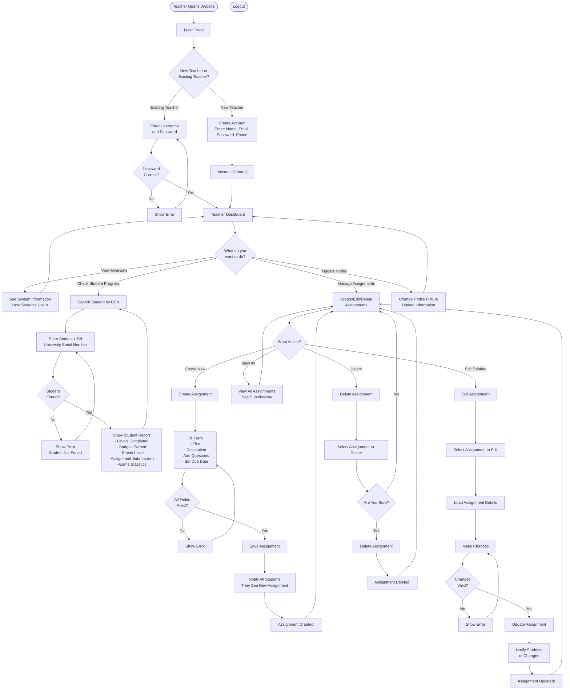

# Teacher Flowchart - Simple Guide

## What is a Flowchart?
A flowchart shows step-by-step what happens when a teacher uses the system. Think of it like a map showing the path from start to finish.

## Teacher Journey - Simple Version

## How Assignments Work - Simple Explanation

**Step 1:** Teacher clicks "Create Assignment"

**Step 2:** Teacher fills in:
- Title (e.g., "Week 1 Quiz")
- Description (what students need to do)
- Questions (add multiple questions with options)
- Due Date (when students must submit)

**Step 3:** Teacher saves the assignment

**Step 4:** All students automatically get notified about the new assignment

**Step 5:** Students can view and submit the assignment

**Step 6:** Teacher can see all student submissions

## Tracking Student Progress - Simple Explanation

**Step 1:** Teacher enters student's USN (University Serial Number)

**Step 2:** System searches for the student

**Step 3:** If found, teacher sees:
- How many levels completed (Easy, Medium, Hard)
- How many badges earned
- Current streak level
- Assignment submissions
- Overall game statistics

**Step 4:** Teacher can use this information to help the student improve

## Key Points for Teachers

1. **Login:** Use your username and password
2. **Create Assignments:** Add questions, set due dates, notify students
3. **Track Progress:** Search by USN to see how each student is doing
4. **Edit/Delete:** Can modify or remove assignments you created
5. **Notifications:** Students automatically get notified when you create or update assignments
