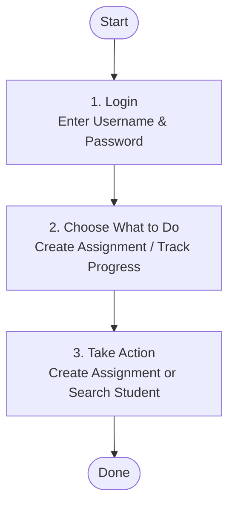
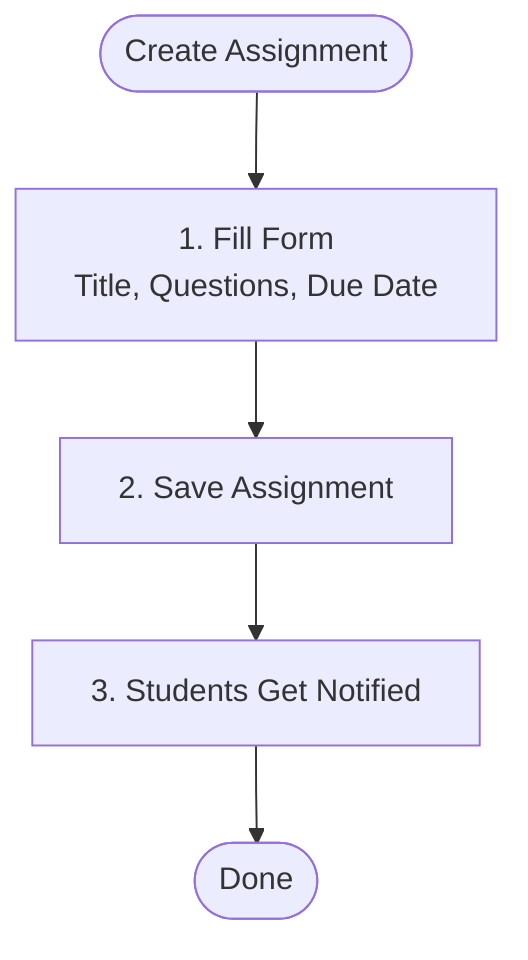
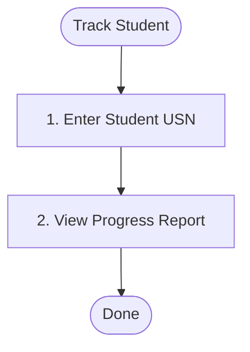

# Teacher Flowchart - Simple

## Teacher Workflow

```mermaid
flowchart TD
    Start([Start]) --> Login[1. Login<br/>Enter Username & Password]
    Login --> Dashboard[2. Choose What to Do<br/>Create Assignment / Track Progress]
    Dashboard --> Action[3. Take Action<br/>Create Assignment or Search Student]
    Action --> End([Done])
```

## Teacher Assignment Flow

```mermaid
flowchart TD
    Start([Create Assignment]) --> Fill[1. Fill Form<br/>Title, Questions, Due Date]
    Fill --> Save[2. Save Assignment]
    Save --> Notify[3. Students Get Notified]
    Notify --> End([Done])
```

## Teacher Progress Tracking Flow

```mermaid
flowchart TD
    Start([Track Student]) --> Search[1. Enter Student USN]
    Search --> View[2. View Progress Report]
    View --> End([Done])
```
