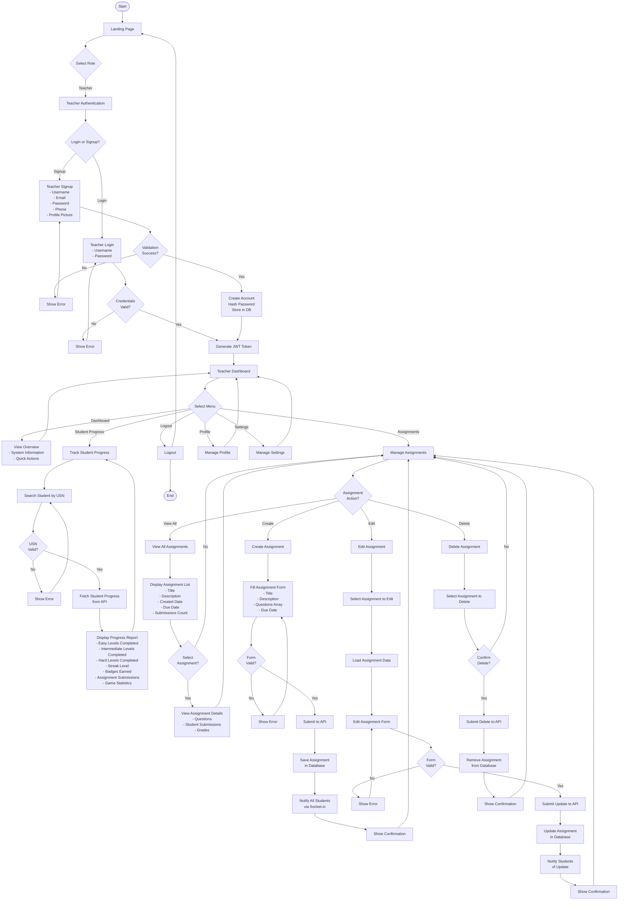
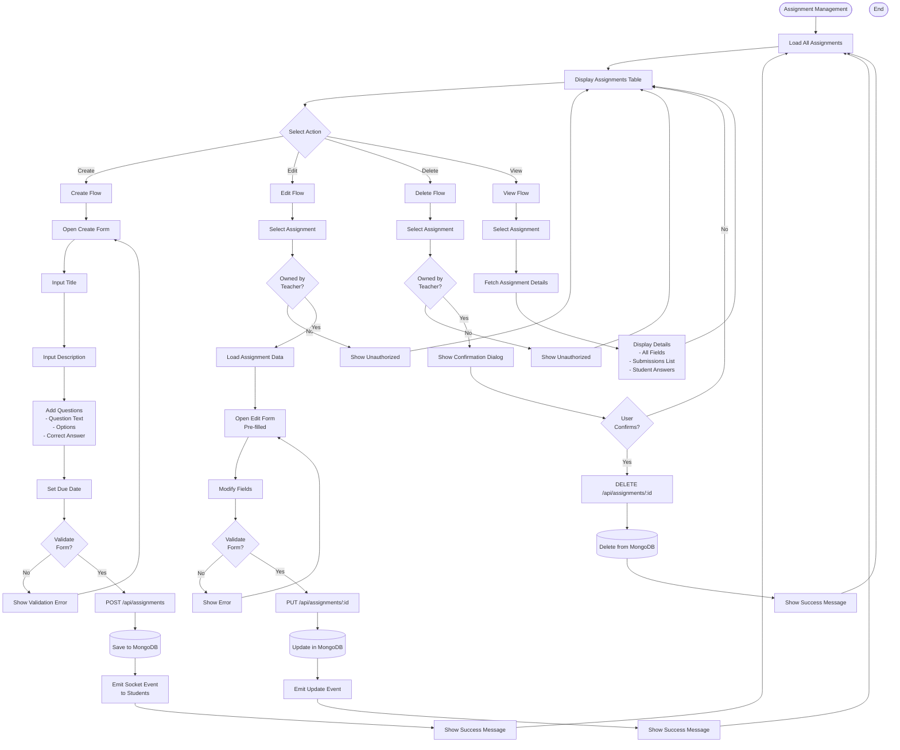
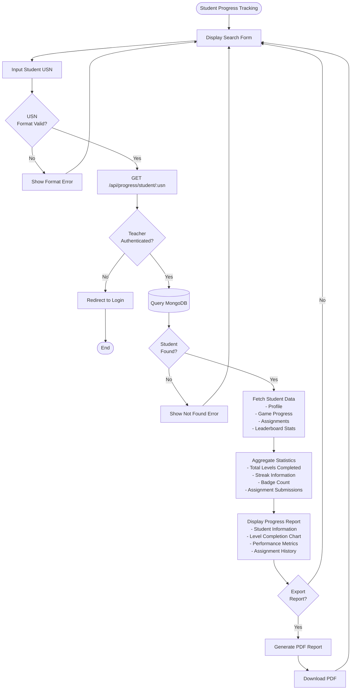

# Teacher Flowchart

## Teacher Main Flowchart

```mermaid
flowchart TD
    Start([Start]) --> LandingPage[Landing Page]
    LandingPage --> RoleSelect{Select Role}
    RoleSelect -->|Teacher| TeacherAuth[Teacher Authentication]
    
    TeacherAuth --> AuthChoice{Login or Signup?}
    AuthChoice -->|Signup| Signup[Teacher Signup<br/>- Username<br/>- Email<br/>- Password<br/>- Phone<br/>- Profile Picture]
    AuthChoice -->|Login| Login[Teacher Login<br/>- Username<br/>- Password]
    
    Signup --> ValidateSignup{Validation<br/>Success?}
    ValidateSignup -->|No| SignupError[Show Error] --> Signup
    ValidateSignup -->|Yes| CreateAccount[Create Account<br/>Hash Password<br/>Store in DB]
    
    Login --> ValidateLogin{Credentials<br/>Valid?}
    ValidateLogin -->|No| LoginError[Show Error] --> Login
    ValidateLogin -->|Yes| GenerateToken[Generate JWT Token]
    
    CreateAccount --> GenerateToken
    GenerateToken --> TeacherDashboard[Teacher Dashboard]
    
    TeacherDashboard --> MenuChoice{Select Menu}
    
    MenuChoice -->|Dashboard| ViewOverview[View Overview<br/>- System Information<br/>- Quick Actions]
    MenuChoice -->|Student Progress| TrackProgress[Track Student Progress]
    MenuChoice -->|Assignments| ManageAssignments[Manage Assignments]
    MenuChoice -->|Profile| ManageProfile[Manage Profile]
    MenuChoice -->|Settings| ManageSettings[Manage Settings]
    MenuChoice -->|Logout| Logout[Logout] --> LandingPage
    
    ViewOverview --> TeacherDashboard
    ManageProfile --> TeacherDashboard
    ManageSettings --> TeacherDashboard
    
    TrackProgress --> SearchStudent[Search Student by USN]
    SearchStudent --> ValidateUSN{USN<br/>Valid?}
    ValidateUSN -->|No| ShowError[Show Error] --> SearchStudent
    ValidateUSN -->|Yes| FetchProgress[Fetch Student Progress<br/>from API]
    
    FetchProgress --> DisplayProgress[Display Progress Report<br/>- Easy Levels Completed<br/>- Intermediate Levels Completed<br/>- Hard Levels Completed<br/>- Streak Level<br/>- Badges Earned<br/>- Assignment Submissions<br/>- Game Statistics]
    DisplayProgress --> TrackProgress
    
    ManageAssignments --> AssignmentChoice{Assignment<br/>Action?}
    AssignmentChoice -->|View All| ViewAllAssignments[View All Assignments]
    AssignmentChoice -->|Create| CreateAssignment[Create Assignment]
    AssignmentChoice -->|Edit| EditAssignment[Edit Assignment]
    AssignmentChoice -->|Delete| DeleteAssignment[Delete Assignment]
    
    ViewAllAssignments --> DisplayList[Display Assignment List<br/>- Title<br/>- Description<br/>- Created Date<br/>- Due Date<br/>- Submissions Count]
    DisplayList --> SelectAssignment{Select<br/>Assignment?}
    SelectAssignment -->|Yes| ViewDetails[View Assignment Details<br/>- Questions<br/>- Student Submissions<br/>- Grades]
    SelectAssignment -->|No| ManageAssignments
    ViewDetails --> ManageAssignments
    
    CreateAssignment --> FillForm[Fill Assignment Form<br/>- Title<br/>- Description<br/>- Questions Array<br/>- Due Date]
    FillForm --> ValidateForm{Form<br/>Valid?}
    ValidateForm -->|No| ShowFormError[Show Error] --> FillForm
    ValidateForm -->|Yes| SubmitCreate[Submit to API]
    SubmitCreate --> SaveAssignment[Save Assignment<br/>in Database]
    SaveAssignment --> NotifyStudents[Notify All Students<br/>via Socket.io]
    NotifyStudents --> Confirmation[Show Confirmation]
    Confirmation --> ManageAssignments
    
    EditAssignment --> SelectEditAssignment[Select Assignment to Edit]
    SelectEditAssignment --> LoadAssignment[Load Assignment Data]
    LoadAssignment --> EditForm[Edit Assignment Form]
    EditForm --> ValidateEdit{Form<br/>Valid?}
    ValidateEdit -->|No| ShowEditError[Show Error] --> EditForm
    ValidateEdit -->|Yes| SubmitEdit[Submit Update to API]
    SubmitEdit --> UpdateAssignment[Update Assignment<br/>in Database]
    UpdateAssignment --> NotifyStudentsUpdate[Notify Students<br/>of Update]
    NotifyStudentsUpdate --> EditConfirmation[Show Confirmation]
    EditConfirmation --> ManageAssignments
    
    DeleteAssignment --> SelectDeleteAssignment[Select Assignment to Delete]
    SelectDeleteAssignment --> ConfirmDelete{Confirm<br/>Delete?}
    ConfirmDelete -->|No| ManageAssignments
    ConfirmDelete -->|Yes| SubmitDelete[Submit Delete to API]
    SubmitDelete --> RemoveAssignment[Remove Assignment<br/>from Database]
    RemoveAssignment --> DeleteConfirmation[Show Confirmation]
    DeleteConfirmation --> ManageAssignments
    
    End([End])
    Logout --> End
```

## Teacher Assignment Management Flowchart

```mermaid
flowchart TD
    Start([Assignment Management]) --> LoadAssignments[Load All Assignments]
    LoadAssignments --> DisplayAssignments[Display Assignments Table]
    
    DisplayAssignments --> ActionChoice{Select Action}
    
    ActionChoice -->|Create| CreateFlow[Create Flow]
    ActionChoice -->|Edit| EditFlow[Edit Flow]
    ActionChoice -->|Delete| DeleteFlow[Delete Flow]
    ActionChoice -->|View| ViewFlow[View Flow]
    
    CreateFlow --> CreateForm[Open Create Form]
    CreateForm --> InputTitle[Input Title]
    InputTitle --> InputDescription[Input Description]
    InputDescription --> AddQuestions[Add Questions<br/>- Question Text<br/>- Options<br/>- Correct Answer]
    AddQuestions --> SetDueDate[Set Due Date]
    SetDueDate --> ValidateCreate{Validate<br/>Form?}
    ValidateCreate -->|No| ShowError[Show Validation Error] --> CreateForm
    ValidateCreate -->|Yes| SubmitCreate[POST /api/assignments]
    SubmitCreate --> SaveDB[(Save to MongoDB)]
    SaveDB --> NotifySocket[Emit Socket Event<br/>to Students]
    NotifySocket --> SuccessCreate[Show Success Message]
    SuccessCreate --> LoadAssignments
    
    EditFlow --> SelectAssignment[Select Assignment]
    SelectAssignment --> CheckOwnership{Owned by<br/>Teacher?}
    CheckOwnership -->|No| Unauthorized[Show Unauthorized] --> DisplayAssignments
    CheckOwnership -->|Yes| LoadData[Load Assignment Data]
    LoadData --> EditForm[Open Edit Form<br/>Pre-filled]
    EditForm --> ModifyFields[Modify Fields]
    ModifyFields --> ValidateEdit{Validate<br/>Form?}
    ValidateEdit -->|No| ShowEditError[Show Error] --> EditForm
    ValidateEdit -->|Yes| SubmitEdit[PUT /api/assignments/:id]
    SubmitEdit --> UpdateDB[(Update in MongoDB)]
    UpdateDB --> NotifyUpdate[Emit Update Event]
    NotifyUpdate --> SuccessEdit[Show Success Message]
    SuccessEdit --> LoadAssignments
    
    DeleteFlow --> SelectDelete[Select Assignment]
    SelectDelete --> CheckDeleteOwnership{Owned by<br/>Teacher?}
    CheckDeleteOwnership -->|No| UnauthorizedDelete[Show Unauthorized] --> DisplayAssignments
    CheckDeleteOwnership -->|Yes| ConfirmDialog[Show Confirmation Dialog]
    ConfirmDialog --> UserConfirm{User<br/>Confirms?}
    UserConfirm -->|No| DisplayAssignments
    UserConfirm -->|Yes| SubmitDelete[DELETE /api/assignments/:id]
    SubmitDelete --> DeleteDB[(Delete from MongoDB)]
    DeleteDB --> SuccessDelete[Show Success Message]
    SuccessDelete --> LoadAssignments
    
    ViewFlow --> SelectView[Select Assignment]
    SelectView --> FetchDetails[Fetch Assignment Details]
    FetchDetails --> DisplayDetails[Display Details<br/>- All Fields<br/>- Submissions List<br/>- Student Answers]
    DisplayDetails --> DisplayAssignments
    
    End([End])
```

## Teacher Student Progress Tracking Flowchart

```mermaid
flowchart TD
    Start([Student Progress Tracking]) --> SearchForm[Display Search Form]
    SearchForm --> InputUSN[Input Student USN]
    InputUSN --> ValidateUSN{USN<br/>Format Valid?}
    
    ValidateUSN -->|No| ShowFormatError[Show Format Error] --> SearchForm
    ValidateUSN -->|Yes| SubmitSearch[GET /api/progress/student/:usn]
    
    SubmitSearch --> CheckAuth{Teacher<br/>Authenticated?}
    CheckAuth -->|No| RedirectLogin[Redirect to Login] --> End
    CheckAuth -->|Yes| QueryDB[(Query MongoDB)]
    
    QueryDB --> StudentExists{Student<br/>Found?}
    StudentExists -->|No| ShowNotFound[Show Not Found Error] --> SearchForm
    StudentExists -->|Yes| FetchData[Fetch Student Data<br/>- Profile<br/>- Game Progress<br/>- Assignments<br/>- Leaderboard Stats]
    
    FetchData --> AggregateStats[Aggregate Statistics<br/>- Total Levels Completed<br/>- Streak Information<br/>- Badge Count<br/>- Assignment Submissions]
    
    AggregateStats --> DisplayReport[Display Progress Report<br/>- Student Information<br/>- Level Completion Chart<br/>- Performance Metrics<br/>- Assignment History]
    
    DisplayReport --> ExportOption{Export<br/>Report?}
    ExportOption -->|Yes| GeneratePDF[Generate PDF Report]
    ExportOption -->|No| SearchForm
    
    GeneratePDF --> DownloadPDF[Download PDF]
    DownloadPDF --> SearchForm
    
    End([End])
```

